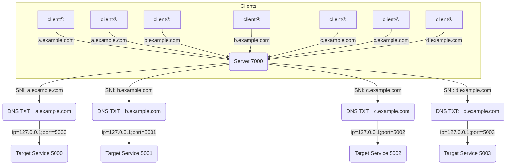

# SNI 动态路由代理
基于 TLS Hello包中的 SNI 信息实时解析并转发至目标服务端口。

## 环境准备
- php 8.1+
- swoole/swow/fiber/event扩展
- 两个服务端，一个客户端（强制启用 TLS）
- dns 解析

## 使用说明
1. 启动代理服务并放行防火墙代理端口。
```php
php start.php start -d
```
2. 将域名解析到代理服务ip。实际情况根据自己情况调整。
```text
a.example.com  192.168.1.100  // A 记录
b.example.com  192.168.1.100  // A 记录
_a.example.com  ip=127.0.0.1;port=5000  // TXT 记录
_b.example.com  ip=127.0.0.1;port=5001  // TXT 记录
```
3. 访问a.example.com和b.example.com可查看服务器返回不同端口的页面及为成功。

## 自定义路由
本项目采用dns管理转发的服务器及端口，可以通过更改parseHost方法来实现自定义逻辑。

## 架构图


## 特别感谢
- [workerman](https://github.com/walkor/workerman)
- [通义灵码](https://lingma.aliyun.com/?utm_content=se_1021066852)
- [PhpStorm](https://www.jetbrains.com/phpstorm/)